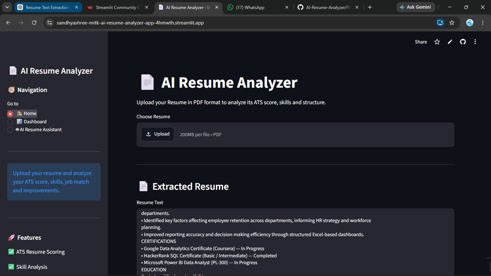
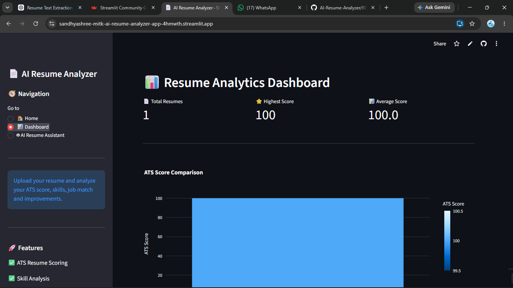
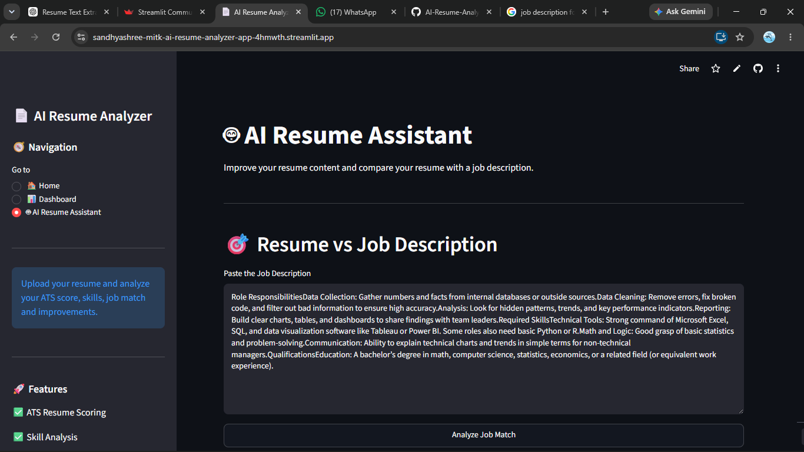

# 📄 AI Resume Analyzer

An AI-powered Resume Analyzer that evaluates resumes, calculates ATS scores, identifies missing skills, compares resumes with job descriptions, provides AI-powered recommendations, and generates downloadable PDF reports.

## 🌐 Live Demo

https://sandhyashree-mitk-ai-resume-analyzer-app-4hmwth.streamlit.app

## ✨ Features

- 📄 Upload resume in PDF format
- 🔍 Extract resume information automatically
- 📊 Calculate ATS Resume Score
- 👤 Extract name, email, phone, LinkedIn and GitHub
- 🛠️ Analyze technical skills
- 🎓 Extract education details
- 📜 Extract certifications
- 📋 Analyze resume sections
- 🎯 Compare resume with a Job Description
- ✅ Identify matching skills
- ❌ Identify missing skills
- 📚 Recommend courses for missing skills
- 🤖 AI-powered Resume vs Job Analysis
- ✍️ AI Resume Content Rewriter
- 📥 Download AI recommendations
- 📄 Generate downloadable PDF Resume Reports
- 📊 Resume Analytics Dashboard

- ## 📸 Application Screenshots

### 🏠 Home — Resume Analysis



### 📊 Resume Dashboard



### 🤖 AI Resume Assistant



## 🛠️ Technologies Used

### Programming Language
- Python

### Framework
- Streamlit

### Libraries
- PDFPlumber
- Pandas
- NumPy
- Plotly
- Scikit-Learn
- ReportLab
- Google GenAI

### Tools
- Git
- GitHub
- VS Code

## 🔄 How It Works

1. Upload a resume in PDF format.
2. The application extracts the resume text.
3. Resume information such as skills, education and certifications is identified.
4. An ATS score is calculated.
5. Resume sections are analyzed.
6. Users can paste a Job Description.
7. The application compares the resume with the Job Description.
8. Matching and missing skills are displayed.
9. AI provides personalized recommendations.
10. A PDF report can be downloaded.

## 📊 Dashboard

The Resume Analytics Dashboard provides:

- Total resumes analyzed
- Highest ATS score
- Average ATS score
- Resume analysis history
- Resume performance insights

## 🤖 AI Features

The AI Resume Assistant provides:

- Resume vs Job Description analysis
- Missing skill recommendations
- Resume improvement suggestions
- Professional summary improvement
- Project description improvement
- Work experience improvement
- ATS-friendly bullet point generation

## 📂 Project Structure

```text
AI-Resume-Analyzer/
│
├── app.py
├── parser.py
├── ats.py
├── matcher.py
├── dashboard.py
├── history.py
├── section_analyzer.py
├── course_recommender.py
├── resume_rewriter.py
├── report_generator.py
├── requirements.txt
├── .gitignore
└── README.md
